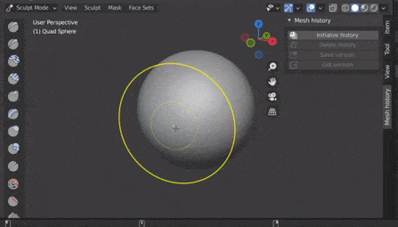

# Mesh History
 / 

Blender add-on to add the functionality to save versions of your mesh. Useful for sculpting when you want to save previous steps or test different ideas. Tested with 2.93.

[Here is an example of how to install an add on](https://www.youtube.com/watch?v=14G_YIVdBd0)

Once installed the tool is available in object mode. Simply click Add -> Armature -> Bendy Bone
